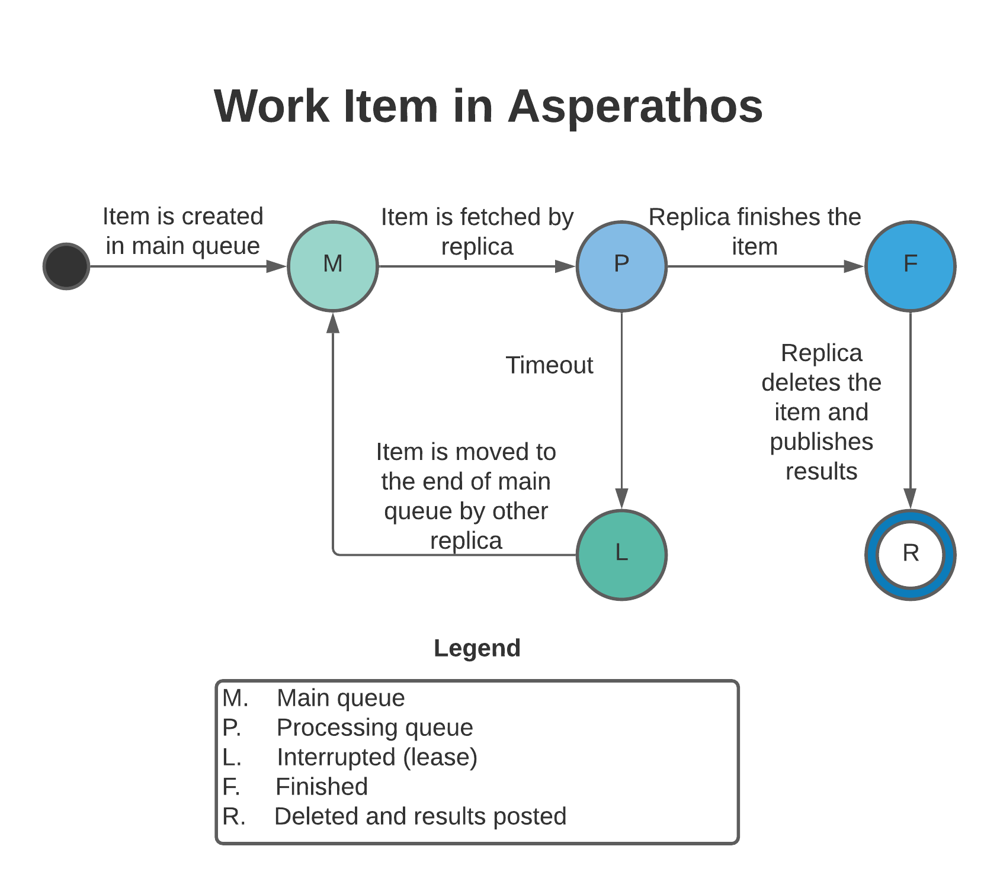

# Information flow of a Job Item

To make the best use of Redis, we propose you to configure your application to work in the manner below.

Once a Job is submitted, the workload is prepared in Redis, who should have three queues: *main*, *processing* e *results*. These queues represent the state of each item put in them.

Each item is put in the *main* queue in sequence, and this means they are ready to be fetched for processing. When a replica of the user's application fetches an item, it moves the item to the end of the *processing* queue, and stays there until the replica finishes processing it. After finishing, the item is deleted as the results produced are pushed in the *results* queue.

When an item stays too long in the *processing* queue, a timeout occurs. This time is defined by the client's application as **LEASE_SECONDS**. It is then considered that this replica is somehow blocked, and thus not reliable to finish this processing in reasonable time. To mitigate this, before fetching an item, every replica checks for items with timeout in the *processing* queue and moves it to the end of the *main* queue. This allows the item to both be used and not get in the way of newer items than itself.

The information diagram below illustrates the changes in state of each item as it changes from queue to queue.

This way, the Monitor component can keep track of the trajectory of each item and use it to create better metrics.