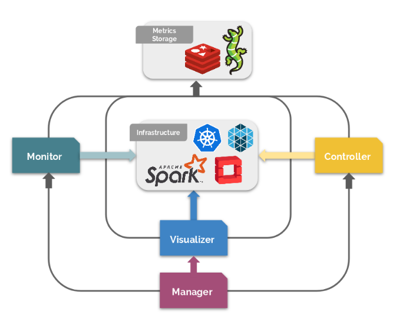

# Asperathos User Guide

## Scope and Purpose

Asperathos is a platform to facilitate the deployment and control of applications running in cloud environments. For example, it can provide Quality of Service (QoS) by controlling resources allocated during runtime. Nevertheless, in contrast to other orchestration tools, such as Kubernetes itself or OpenStack Heat, it can be configured to consider application specific metrics and to actuate in a customized fashion. 

The purpose of this user guide is to show how correctly deploy each of the Asperathos components as well as demonstrate how to implement features in the components to fulfill a goal a specific context.

The requirements to run this user guide are the following: 

* An Ubuntu machine with access to the Internet; 
* Access to a Kubernetes cluster where all credentials are accessible by Kubernetes commands (e.g. through kubectl);

## Process Overview

### Asperathos

The architecture from Asperathos is depicted in the following figure. The platform follows the REST architecture for submissions and is composed by three main modules and one optional module: **(i)** the Manager is the entry point for the user and is responsible for receiving an application submission, triggering all other steps; **(ii)** the Monitor gather, transform and publish metrics collected from applications (e.g., the application progress) or environment resources (e.g., CPU usage); **(iii)** the Controller is the component that adjusts the amount of allocated resources dedicated to an application; **(iv)** the Visualizer, the unique optional component of the system, leverages existing tools to provide rich visualizations of the applications being run by Asperathos. 



Each module above can be customized by plugins. For example, a plugin to deploy the application can be specified in the Manager, another to define the application specific metric can be specified in the Monitor, another to control the actuation logic could be configured in the Controller, another to launch a specific visualization platform and so on. 

In the following sections each of the Asperathos components above mentioned will be described in more details: 

#### Manager

The Asperathos Manager is a REST API that is the core of the framework. On the process of executing a request, it is responsible for preparing the environment (e.g. deploy virtual machines and configure a cluster), submitting the application and starting or stopping other Asperathos services according to the system needs, (e.g. start to monitor the progress of an application and trigger a controller to be prepared to adjust resources based on this progress metric to provide assurance on meeting the application QoS). When an application is submitted with QoS requirements and it must use Monitor and Controller services, the user/system makes a single request to the Manager containing all the information necessary to execute all the components (e.g. plugin names, metric to be monitored, QoS rules and actuation interval) and it splits the request to the other services via REST requests. 

To provide flexibility and to support different types of applications in different infrastructure environments, it follows a plugin architecture that makes it possible to perform customizations during the service deployment in which plugins must be activated. 

#### Monitor 

The monitor service execute all the necessary steps to gather metrics from some source of information about the applications and/or its infrastructure and publish it in some storage. This catch can be from a simple one that consults an API that already provides the metric directly to a more difficult one that will need some semantic analysis to extract the actual metric from logs, for example. The goal of this metric translation is to enable other components in the platform (e.g., the controller) to be generic, while still being able to process QoS metrics for the application and take decisions based on these metrics. 

The architecture of the system is also plugin-based, allowing the same characteristics of the Manager and Controller, where is possible to enable only the plugins that will be used for some context. The service is a REST API with two endpoints: start_monitoring and stop_monitoring. The same plugin also can gather different metrics and push it to different storages. 

#### Controller

The controller is the component in asperathos responsible for deciding (over a set of data from the application, cluster, network, etc.) what is the best action to take in a specified time. During the application life cycle, it is possible to be above the expected time, bellow or equal in progress or time. In each case the controller can be configured to take different actions. 

The actuator is the hand to take action when a controller makes a scaling decision. The different plugins can scale up or down virtual machines, workers, processes, and other resources in order to increase the speed of a big data application and provide quality of service. Examples of actuator plugins are: OpenStack generic, marathon, Spark, etc. 

The trigger fields passed as configuration to the controller sets the decision time for the controller. Trigger down sets the percentage of application progress over the expected deadline to scale the resources down in order to save computing resources in a way that the application is not disturbed. Trigger up is the percentage of application error enough to scale the resources up and increase application speed to ensure QoS (this value is usually 0 so that whenever the application is delayed the controller decides to actuate). 

The controller is implemented following a plugin architecture, providing flexibility to add or remove plugins when necessary. It works with usage of three types of plugins: Actuator, Controller and Metric Source.

* The **Controller**, based on metrics such as application progress and CPU usage, decides the amount of resources to allocate to the applications.

* The **Actuator** is responsible for connecting to the underlying infrastructure (such as a Mesos or an OpenStack Sahara platform) and triggering the commands or API calls that allocate or deallocate resources, based on the Controller’s requests.

* The **Metric Source** plugin is responsible for getting application metrics from a metric source, such as Monasca, and returning them to the Controller.

#### Visualizer

With the purpose of providing a visualization platform where the user can keep track of the job progress, a new component was added to the Asperathos architecture. The Visualizer is a optional service that consumes the job metrics collected by the Monitor component and display graphics of these metrics in a dashboard, allowing the user to observe the behavior of the job through all its execution. 

The architecture of this component was implemented following the same characteristics of the Manager, Monitor, and Controller components. Therefore it is a plugin-based system that can be configured or not for a specific scenario. The service is a REST API with three endpoints: start_visualization, stop_visualization and get_visualizer_url. 

### Kubejobs Plugin

With the KubeJobs plugin it is possible to trigger applications, monitor progress metrics for an application, and control Kubernetes in real time based. The following steps describes the basic flow of an execution using KubeJobs:

1. The client sends a POST request to the Asperathos Manager with a JSON body describing the execution.
2. The Manager creates a Redis service in the cluster, enqueues the items described in the input file in Redis through the queue auxiliary service.
3. The application execution is triggered on the cluster.
4. The application running on Kubernetes cluster starts to consume items from the Redis storage.
5. The Monitor is triggered by the Manager when application starts to run.
6. The Monitor periodically gets the number of processed items from the queued service.
7. As soon as metrics are being published, the Manager starts the Controller, which consumes metrics from Redis to take decisions about scaling based on the predefined control logic.

### Vertical Strategy

Summarizing, the goal of the Vertical strategy is to control the CPU quota of the nodes that comprises an Kubernetes cluster using the CPU utilization of this nodes as trigger. The following steps describes the basic flow of an execution using the Vertical strategy.

1. The client sends a POST request to the Asperathos Manager with a JSON body describing the execution.
2. The application execution is triggered on the cluster.
3. The application running on Kubernetes cluster starts to consume CPU percentage from the nodes.
4. The Monitor is triggered by the Manager when application starts to run.
5. The Monitor periodically gets the CPU usage of the nodes contained in the cluster.
6. As soon as metrics are being published, the Manager starts the Controller, which consumes CPU metrics and decides if scales up or down the CPU quota of the node.

## Component's Rest API Endpoints

### Manager

#### Submit and run
  Run a submission and returns json data with id of submission.

* **URL**: `/submissions`
* **Method:** `POST`

* **JSON Request:**
	* ```javascript
	  {
	     username : [string],
	     password : [string],
	     plugin: [string],
	     plugin_info : {
	         ...
	     }
	  }
	  ```
* **Success Response:**
  * **Code:** `202` <br /> **Content:** 
	  * ```javascript
	    {
	       job_id : [string]
	    }
		```
		
* **Error Response:**
  * **Code:** `400 BAD REQUEST` and `401 UNAUTHORIZED`<br />


#### Stop submission
  Stop a running submission.

* **URL**: `/submissions/:id/stop`
* **Method:** `PUT`

* **JSON Request:**
	* ```javascript
	  {
	     username : [string],
	     password : [string]
	  }
	  ```
* **Success Response:**
  * **Code:** `204` <br />
		
* **Error Response:**
  * **Code:** `400 BAD REQUEST` and `401 UNAUTHORIZED`<br />

#### List submissions
  List all submissions.

* **URL**: `/submissions`
* **Method:** `GET`
* **Success Response:**
  * **Code:** `200` <br /> **Content:** 
	  * ```javascript
	    {
	       submission1 : {
	          status: [string]
	       },
     	   [...],
	       submissionN : {
	          status: [string]
	       }		 
	    }
		```

#### Submission status
  Returns json data with detailed status of submission.

* **URL**: `/submissions/:id`
* **Method:** `GET`
* **Success Response:**
  * **Code:** `200` <br /> **Content:** 
	  * ```javascript
	    {
	       status : [string],
	       execution_time : [string],
	       start_time : [string]
	    }
		```
		
* **Error Response:**
  * **Code:** `400 BAD REQUEST` <br />

#### Submission log
  Returns json data with log of submission.

* **URL**: `/submissions/:id/log`
* **Method:** `GET`
* **Success Response:**
  * **Code:** `200` <br /> **Content:** 
	  * ```javascript
	    {
	       execution : [string],
  	       stderr : [string],
  	       stdout : [string]
	    }
		```
		
* **Error Response:**
  * **Code:** `400 BAD REQUEST` <br />

### Monitor

#### Start monitoring
  Start monitoring an application.

* **URL**: `/monitoring/:app_id`
* **Method:** `POST`

* **JSON Request:**
	* ```javascript
	  {
	     plugin: [string],
	     plugin_info : {
	         [...]
	     }
	  }
	  ```
* **Success Response:**
  * **Code:** `204` <br />
		
* **Error Response:**
  * **Code:** `400 BAD REQUEST` <br />

#### Stop monitoring
  Stop monitoring of an application.

* **URL**: `/monitoring/:app_id/stop`
* **Method:** `PUT`

* **Success Response:**
  * **Code:** `204` <br />
		
* **Error Response:**
  * **Code:** `400 BAD REQUEST` <br />

### Controller

#### Prepare environment 
  Sets the amount of resources allocated to instances.

* **URL**: `/setup`
* **Method:** `POST`

* **JSON Request:**
	* ```javascript
	  {
	     actuator_plugin: [string],
	     instances_cap : {
	       "vm_id0":cap0,
	       "vm_id1":cap1,
	       ...
	       "vm_idn":capn
	     }
	  }
	  ```
* **Success Response:**
  * **Code:** `204` <br />
		
* **Error Response:**
  * **Code:** `400 BAD REQUEST`

#### Start scaling 
  Adds the application to the set of applications the Controller scales.

* **URL**: `/scaling/:app_id`
* **Method:** `POST`

* **JSON Request:**
	* ```javascript
	  {
	     plugin: [string],
	     plugin_info : {
	       ...
	     }
	  }
	  ```
* **Success Response:**
  * **Code:** `204` <br />
		
* **Error Response:**
  * **Code:** `400 BAD REQUEST`

#### Stop scaling 
  Removes the application from the set of applications the Controller scales.

* **URL**: `/scaling/:app_id/stop`
* **Method:** `PUT`

* **Success Response:**
  * **Code:** `204` <br />
		
* **Error Response:**
  * **Code:** `400 BAD REQUEST`<br />

#### Controller status
  Returns json data with detailed status of Controller.

* **URL**: `/scaling`
* **Method:** `GET`
* **Success Response:**
  * **Code:** `200` <br /> **Content:** 
	  * ```javascript
	    {
	       scaling1 : {
	          status: [string]
	       },
     	       ...
	       scalingN : {
	          status: [string]
	       }		 
	    }
		```

### Visualizer

#### Start visualization
  Start the visualization of a running application.

* **URL**: `/visualizing`
* **Method:** `POST`

* **JSON Request:**
	* ```javascript
	  {
	     username : [string],
	     password : [string],
	     plugin: [string],
	     plugin_info : {
	         ...
	     }
	  }
	  ```
* **Success Response:**
  * **Code:** `202` <br /> **Content:** 
	  * ```javascript
	    {
	       job_id : [string]
	    }
		```
		
* **Error Response:**
  * **Code:** `400 BAD REQUEST` and `401 UNAUTHORIZED`<br />


#### Stop visualization
  Stop the visualization of a running application.

* **URL**: `/visualizing/:id/stop`
* **Method:** `PUT`

* **JSON Request:**
	* ```javascript
	  {
	     username : [string],
	     password : [string]
	  }
	  ```
* **Success Response:**
  * **Code:** `204` <br />
		
* **Error Response:**
  * **Code:** `400 BAD REQUEST` and `401 UNAUTHORIZED`<br />

#### Get visualization URL
  Returns the url of the visualizer of the job.

* **URL**: `/visualizing/:id`
* **Method:** `GET`
* **Success Response:**
  * **Code:** `200` <br /> **Content:** 
	  * ```javascript
	    {
	       url : [string]		 
	    }
		```

## Tutorials

### How to deploy an Asperathos instance?

#### Deploying Manager component

1. Using a exclusive terminal, clone Asperathos-Manager repository:

```bash
$ git clone https://github.com/ufcg-lsd/asperathos-manager 
$ cd asperathos-manager/
```

2. Run the ‘pre-install.sh’ script that will install the requirements:

```bash
$ ./pre-install.sh
```

3. Run the Asperathos-Manager service:

```bash
$ ./run.sh
```

#### Deploying Monitor component

1. Using a exclusive terminal, clone Asperathos-Monitor repository:

```bash
$ git clone https://github.com/ufcg-lsd/asperathos-monitor 
$ cd asperathos-monitor/
```

2. Run the ‘pre-install.sh’ script that will install the requirements:

```bash
$ ./pre-install.sh
```

3. Run the Asperathos-Monitor service :

```bash
$ ./run.sh
```

#### Deploying Controller component

1. Using a exclusive terminal, clone Asperathos-Controller repository:

```bash
$ git clone https://github.com/ufcg-lsd/asperathos-controller 
$ cd asperathos-controller/
```

2. Run the ‘pre-install.sh’ script that will install the requirements:

```bash
$ ./pre-install.sh
```

3. Run the Asperathos-Controller service:

```bash
$ ./run.sh
```

#### Deploying Visualizer component (Optional)

1. Using a exclusive terminal, clone Asperathos-Visualizer repository:

```bash
$ git clone https://github.com/ufcg-lsd/asperathos-visualizer 
$ cd asperathos-visualizer/
```

2. Run the ‘pre-install.sh’ script that will install the requirements:

```bash
$ ./pre-install.sh
```

3. Run the Asperathos-Visualizer service:

```bash
$ ./run.sh
```

### How to configure Asperathos components to execute the KubeJobs plugin?

#### Configure the Manager component

1. Access the Asperathos-Manager folder:

```bash
$ cd path/to/asperathos-manager
```

2. Modify the file ‘broker.cfg’ with the required informations to run the KubeJobs plugin. You can check below an template of how the ‘broker.cfg’ file should look like:

```
[general]
host = 0.0.0.0
port = 1500
plugins = kubejobs

[services]
controller_url = http://0.0.0.0:5000
monitor_url = http://0.0.0.0:5001
optimizer_url = http://0.0.0.0:5003
authorization_url = http://0.0.0.0:5004

[kubejobs]
k8s_conf_path = /home/user/.kube/config
redis_ip = 10.0.0.1
count_queue = 10.0.0.1:30666
```

Description of the required variables:

* **k8s_conf_path**: The path for the configuration file of the Kubernetes cluster that will be used.
* **redis_ip**: ip of the one of the nodes contained in the Kubernetes clusters that will be used.
* **count_queue**: Count queue ip. Can be the ip of one of the nodes contained in the Kubernetes clusters that will be used.

3. Run the Asperathos-Manager service:

```bash
path/to/asperathos-manager$ ./run.sh
```

#### Configure the Monitor component

1. Access the Asperathos-Monitor folder:

```bash
$ cd path/to/asperathos-monitor
```

2. Modify the file ‘monitor.cfg’ with the required informations to run the KubeJobs plugin. You can check below an template of how the ‘monitor.cfg’ file should look like:

```
[general]
host = 0.0.0.0
port = 5001
plugins = kubejobs
debug = True
retries = 5
```

3. Run the Asperathos-Monitor service:

```bash
path/to/asperathos-monitor$ ./run.sh
```

#### Configure the Controller component

1. Access the Asperathos-Controller folder:

```bash
$ cd path/to/asperathos-controller
```

2. Modify the file ‘controller.cfg’ with the required informations to run the KubeJobs plugin. The KubeJobs plugin requires the k8s-replicas actuator to be activated as well as a specific metric_source_plugin. In this example we will use ‘monasca’ as metric_source_plugin. You can check below an template of how the ‘controller.cfg’ file should look like:

```
[general]
host = 0.0.0.0
port = 5000
actuator_plugins = k8s_replicas
metric_source_plugins = monasca

[monasca]
monasca_endpoint = https://monasca-url:port/v2.0
username = user
password = psswrd
project_name = admin
auth_url = https://monasca-url:port/v3/
api_version = 2_0

[k8s_replicas]
k8s_manifest = /home/user/.kube/config
```

Description of the required variable:

* **k8s_manifest**: The path for the configuration file of the Kubernetes cluster that will be used.

3. Run the Asperathos-Controller service:

```bash
path/to/asperathos-controller$ ./run.sh
```

### How to submit a KubeJobs job?

1. First, create a file named ‘kubejobs-job.json’. The content of this file will have all necessary commands to activate each plugin of each Asperathos component. Also, this JSON file also contains information about the user credentials, workload that will be running, image that will be used and so on. You can check below an template of how the ‘kubejobs-job.json’ file should look like:

```json
{  
   "plugin":"kubejobs",
   "plugin_info":{  
      "username": "user",
      "password": "psswrd",
      "cmd":[  
         ...
      ],
      "img": "img-url:port",
      "init_size": 1,      
      "redis_workload": "workload-url",
      "config_id": "id",
      "control_plugin": "kubejobs",
      "control_parameters": {  
         "max_size": 10,
         "actuator": "k8s_replicas",
         "check_interval": 5,
         "trigger_down": 0,
         "trigger_up": 0,
         "min_rep": 1,
         "max_rep": 10,
         "actuation_size": 1,
         "metric_source": "redis"
      },
      "monitor_plugin": "kubejobs",
      "monitor_info":{  
         "expected_time": 40
      },
      "env_vars":{  
         [...]
      }
   }
}
```

2.  Then, in a different terminal, run the following command to submit the job to the Manager component.

```bash
$ cd path/to/kubejobs.json
$ curl -H "Content-Type: application/json" --data @kubejobs-job.json http://0.0.0.0:1500/submissions
```

### How to configure Asperathos components to execute the Vertical strategy?

#### Configure the Manager component

1. Access the Asperathos-Manager folder:

```bash
$ cd path/to/asperathos-manager
```

2. Modify the file ‘broker.cfg’ with the required informations to run the KubeJobs plugin. You can check below an template of how the ‘broker.cfg’ file should look like:

```
$ [general]
host = 0.0.0.0
port = 1500
plugins = kubejobs

[services]
controller_url = http://0.0.0.0:5000
monitor_url = http://0.0.0.0:5001
optimizer_url = http://0.0.0.0:5003
authorization_url = http://0.0.0.0:5004

[kubejobs]
k8s_conf_path = /home/user/.kube/config
redis_ip = 10.0.0.1
count_queue = 10.0.0.1:30666
```

Description of the required variables:

* **k8s_conf_path**: The path for the configuration file of the Kubernetes cluster that will be used.
* **redis_ip**: ip of the one of the nodes contained in the Kubernetes clusters that will be used.
* **count_queue**: Count queue ip. Can be the ip of one of the nodes contained in the Kubernetes clusters that will be used.

#### Configure the Monitor component

1. Access the Asperathos-Monitor folder:

```bash
$ cd path/to/asperathos-monitor
```

2. The monitor needs to be configured to run the ‘external-api’ plugin. Specific variables need to be informed as well as information about a monitoring platform. In this example we will use ‘monasca’ as monitoring platform. 

Therefore it is required to modify the file ‘monitor.cfg’ with the required informations. You can check below an template of how the ‘monitor.cfg’ file should look like:

```
[general]
host = 0.0.0.0
port = 5001
plugins = external_api
debug = True
retries = 5

[monasca]
monasca_endpoint = https://monasca-url:port/v2.0
username = user
password = psswrd
project_name = admin
auth_url = https://monasca-url:port/v3/
api_version = 2_0

[external_api]
metric_source = cpu
get_metric_endpoint = cpu-quota
threshold = 0.5
k8s_manifest = /home/user/.kube/confi
```

Description of the required variables:

* **metric_source**: The metric collected with the support of the external api.
* **get_metric_endpoint**: Endpoint used to perform the GET request to the api.
* **threshold**: Trigger that will activate the scale up/down.
* **k8s_manifest**: The path for the configuration file of the Kubernetes cluster that will be used.

3. Run the Asperathos-Monitor service :

```bash
path/to/asperathos-monitor$ ./run.sh
```

#### Configure the Controller component

1. Access the Asperathos-Controller folder:

```bash
$ cd path/to/asperathos-controller
```

2. Modify the file ‘controller.cfg’ with the required informations. The Vertical strategy requires the external_api actuator to be activated as well as a specific metric_source_plugin. In this example we will use ‘monasca’ as metric_source_plugin. You can check below an template of how the ‘controller.cfg’ file should look like:

```
[general]
host = 0.0.0.0
port = 5000
actuator_plugins = external_api
metric_source_plugins = monasca

[monasca]
monasca_endpoint = https://monasca-url:port/v2.0
username = user
password = psswrd
project_name = admin
auth_url = https://monasca-url:port/v3/
api_version = 2_0

[external_api]
actuator_metric = cpu
k8s_manifest = /home/user/.kube/config
```

Description of the required variable:

* **actuator_metric**: The metric collected with the support of the external api.
* **k8s_manifest**: The path for the configuration file of the Kubernetes cluster that will be used.

3. Run the Asperathos-Controller service:

```bash
path/to/asperathos-controller$ ./run.sh
```

#### How to submit a KubeJobs job?

1. First, create a file named ‘vertical-job.json’. The content of this file will have all necessary commands to activate each plugin of each Asperathos component. Also, this JSON file also contains information about the user credentials, workload that will be running, image that will be used and so on. You can check below an template of how the ‘vertical-job.json’ file should look like:

```json
{  
   "plugin": "kubejobs",
   "plugin_info": {  
      "username": "user",
      "password": "psswrd",
      "cmd": [  
         ...
      ],
      "img": "img-url:port",
      "init_size": 1,
      "redis_workload": "workload-url",
      "config_id": "id",
      "control_plugin": "vertical",
      "control_parameters": {  
         "actuator": "external_api",
         "check_interval": 5,
         "trigger_down": 0,
         "trigger_up": 0,
         "min_quota": 30000,
         "max_quota": 100000,
         "metric_source": "redis",
         "actuator_metric": "cpu"
      },
      "monitor_plugin": "external_api",
      "monitor_info": {  
         "expected_time":25
      },
      "env_vars":{  
         [...]
      }
   }
}
```

2. Then, in a different terminal, run the following command to submit the job to the Manager component.

``` bash
$ curl -H "Content-Type: application/json" --data @vertical-job.json http://0.0.0.0:1500/submissions
```

### How activate the Visualizer component?

1. In order to activate the Visualizer component, the JSON file used to submit the job to Asperathos needs to have additional information regarding the plugin that will be used. You can check below an template of how the JSON file should look like:

```json
{  
   "plugin":"manager-plugin",
   "plugin_info":{  
          [...]
      },
      "monitor_plugin":"monitor-plugin",
      "monitor_info":{  
         [...]
      },
      "enable_visualizer":true,
      "visualizer_plugin":"visualizer-plugin",
      "visualizer_info":{  
         [...]
      },
      "env_vars":{
         [...]
      }
   }
}
```

### How to configure Asperathos Visualizer to execute the K8s-Grafana plugin?

1. Access the Asperathos-Visualizer folder:

```bash
$ cd path/to/asperathos-visualizer
```

2. Modify the file ‘visualizer.cfg’ with the required informations to run the K8s-Grafana plugin.. You can check below an template of how the ‘visualizer.cfg’ file should look like:

```
[general]
host = 0.0.0.0
port = 5002
plugins = k8s-grafana
datasources = monasca,influxdb
debug = true
retries = 5

[k8s-grafana]
k8s_conf_path = /home/user/.kube/config
visualizer_type = k8s-grafana
visualizer_ip = 10.11.5.62

[monasca]
name = monasca
type = monasca-datasource
url = https://monasca-url:port
access = proxy
basic_auth = no
auth_type = token
token = 

[influxdb]
name = InfluxDB
type = influxdb
url = https://influxdb-url
access = proxy
```

Description of the required variables:

* **k8s_conf_path**: The path for the configuration file of the Kubernetes cluster that will be used. 
* **visualizer_type**: The visualizer type that will be used
* **visualizer_ip**: The IP where the visualizer will be accessible from. Needs to be the IP of one of the nodes contained in the Kubernetes cluster.

If you want to use Monasca as Datasource, the following variables are required:

* **name**: Name of the Datasource (usually gets the value of ‘monasca’)
* **type**: Type of the Datasource (usually gets the value of ‘monasca-datasource’)
* **url**: Address where Monasca service are answering from.
* **access**: Access type (usually gets the value of ‘proxy’).
* **basic_auth**: Enables the basic authentication (usually gets the value of ‘no’)
* **auth_type**: The authentication type (can get the value of ‘token’)
* **token**: The token of access to the service. Needs to be provided if the ‘auth_type’ variable get the value of ‘token’.

If you want to use InfluxDB as Datasource, the following variables are required:

* **name**: Name of the Datasource (usually gets the value of ‘InfluxDB’)
* **type**: Type of the Datasource (usually gets the value of ‘influxdb’)
* **url**: Address where InfluxDB service will be answering from (usually gets the value of the IP of one of the nodes contained in the Kubernetes cluster).
* **access**: Access type (usually gets the value of ‘proxy’).

3. Run the Asperathos-Visualizer service :

```bash
path/to/asperathos-visualizer$ ./run.sh
```

### How collect the visualization URL of a specific job?

1. After a job be launched with the Visualization flag setted to ‘enable’, it is possible to retrieve the visualization URL to keep track of the job progress at execution time. The following GET request to the Visualizer api can be used to retrieve this information. 

```bash
$ curl visualizer-ip:port/visualizing/id
```

Where:

* **visualizer-ip**: The IP where the visualizer service are running.
* **port**: The port where the visualizer service are answering from.
* **id**: The ID of the job launched.

### How add a new Manager plugin in the Asperathos?

1. The first step is to add the information that the new plugin requires to be executed in the configuration file. Therefore, edit the broker.cfg file to look like the following:

```
[general]
plugins = my_new_plugin

[my_new_plugin]
var1 = 
var2 = 
var3 =
```

**Note**: In this tutorial, we will use my_new_plugin as the plugin name.

Where var1, var2 and var3 are the information that the new plugin requires to be executed.

2. Create a new if statement condition in the file broker/service/api/init.py that will recognize if the new plugin added is informed in the configuration file (broker.cfg). If this condition is true, then the necessary variables to execute the plugin needs to be informed in the broker.cfg file and computed in the broker/service/api/init.py. Following you can check how the file broker/service/api/init.py should look like.

```python
import ConfigParser

try:

[...]

if 'my_new_plugin' in plugins:
    var1 = config.get('my_new_plugin', 'var1')
    var2 = config.get('my_new_plugin', 'var2')
    var3 = config.get('my_new_plugin', 'var3')

[...]
```

3. Create a new folder under broker/plugins with the desired plugin name and add init.py.

4. Write a new python class under broker/plugins/mynewplugin. This class must implement the methods get_title, get_description, to_dict and execute.

* **get_title(self)**: Returns plugin title
* get_description(self):  Returns plugin description
* **to_dict(self)**: Return a dict with the plugin information, name, title and description
* **execute(self, data)**: Actually execute the logic of cluster creation and job execution. Returns information if the execution was successful or not

Following you can check how a ‘MyNewPlugin’ class should look like

```python
from broker.plugins import base

class MyNewPluginProvider(base.PluginInterface):

    def get_title(self):
        return 'My New Plugin'

    def get_description(self):
        return 'My New Plugin'

    def to_dict(self):
        return {
            'name': self.name,
            'title': self.get_title(),
            'description': self.get_description(),
        }

    def execute(self, data):
        return True
```

5. Add the new plugin to setup.py under entry_points:

```python
entry_points={
        'console_scripts': [
            'broker=broker.cli.main:main',
        ],
        'broker.execution.plugins': [
            'my_new_plugin=broker.plugins.my_new_plugin.plugin:MyNewPluginProvider',
        ],
```

**Note**: Make sure that the name matches under setup.py and the broker.cfg otherwise the plugin won’t be loaded.

### How add a new Monitor plugin in the Asperathos?

1. The first step is to add the information that the new plugin requires to be executed in the configuration file. Therefore, edit the monitor.cfg file to look like the following:

```
[general]
host = 0.0.0.0
port = 5001
plugins = my_new_monitor
debug = True
retries = 5

[my_new_monitor]
var1 = 
var2 = 
var3 =
```

**Note**: In this tutorial, we will use my_new_monitor as the plugin name.

Where var1, var2 and var3 are the information that the new plugin requires to be executed.

2. Create a new if statement condition in the file monitor/service/api/init.py that will recognize if the new plugin added is informed in the configuration file (monitor.cfg). If this condition is true, then the necessary variables to execute the plugin needs to be informed in the monitor.cfg file and computed in the monitor/service/api/init.py. Following you can check how the file monitor/service/api/init.py should look like.

```python
import ConfigParser

try:

[...]

if 'my_new_monitor' in plugins:
    var1 = config.get('my_new_monitor', 'var1')
    var2 = config.get('my_new_monitor', 'var2')
    var3 = config.get('my_new_monitor', 'var3')

[...]
```

3. Create a new folder under monitor/plugins with the desired plugin name and add init.py.

4. Write a new python class under monitor/plugins/mynewmonitor. This class must extend monitor.plugins.base and implement only two methods: init and monitoring_application.

* **init(self, app_id, plugin_info, collect_period, retries=60)**

    * **app_id**: it is the application id. It is the only mandatory information about the metric identity, although there may be others.

    * **collect_period**: the time interval to execute monitoring_application
    
    * **retries**: the number of retries when some problem any problem occurs during the any of the steps to gather metrics and publish into the metric store service. When all the retries are consumed, the monitoring service for this application will stop. If the problem disappears before the end of the retries, the retries number reload the initial value. (e.g. the connection is failing with the host where I’m accessing remotely but I don’t wanna give up to monitor this host because this problem can be for a little lapse of time).

    
    * **plugin_info**: it is a dictionary that contains all the information needed specifically for the plugin (e.g.: reference value for an application execution, the url for the service that will provide me the metrics or the path to the log file I need to read to capture the metrics and the host ip where this log is located).

* **monitoring_application(self)**: This method does every necessary step to calculate or capture the metric that must be published. For example, if you will use monasca to gather and publish your metrics, you must create an object monitor.utils.monasca.MonascaClient and use send_metrics([metrics]) to publish the metrics, where [metrics] is a list with the metrics you want to push into monasca and each metric is a dictionary with this following structure:

```javascript
 metric = {'name':  'application-name.metric-namer'
     'value': value
     'timestamp': time.time() * 1000
     'dimensions': self.dimensions}
```

Following you can check how a ‘MyNewMonitor’ class should look like

```python
class MyNewMonitor:

  	def __init__(self, app_id, plugin_info, collect_period, retries=100):
  	# set things up
  	pass
  
  	def monitoring_application(self):
  	# monitoring logic
  	pass
```

5. Edit the MonitorBuilder class adding a new condition to check the plugin name in the start_monitor. Instantiate the plugin in the conditional case.

```python
  […]
  elif plugin_name == "mynewmonitor":
          plugin = MyNewMonitor(app_id, plugin_info, collect_period, retries=retries)
  […]
```

### How add a new Controller plugin in the Asperathos?

1. The first step is to add the information that the new plugin requires to be executed in the configuration file. Therefore, edit the controller.cfg file to look like the following:

```
[general]
host = 0.0.0.0
port = 5000
actuator_plugins = my_new_controller

[my_new_controller]
var1 =
var2 =
var3 =
```

**Note**: In this tutorial, we will use my_new_controller as the plugin name.

Where var1, var2 and var3 are the information that the new plugin requires to be executed.

2. In *controller/plugins* folder, exists three directories (*controller*, *actuator* and *metric_source*). Choose what kind of plugin you will develop and create a new folder under one of these directories with the desired plugin name and add *_\_init__.py*.

3. Create a new if statement condition in the file *controller/service/api/_\_init__.py* that will recognize if the new plugin added is informed in the configuration file (*controller.cfg*). If this condition is true, then the necessary variables to execute the plugin needs to be informed in the *controller.cfg* file and computed in the *controller/service/api/_\_init__.py*.

```python
import ConfigParser

try:

[...]

if 'my_new_controller_plugin' in plugins:
    var1 = config.get('my_new_controller_plugin', 'var1')
    var2 = config.get('my_new_controller_plugin', 'var2')
    var3 = config.get('my_new_controller_plugin', 'var3')

[...]
```

4. Write a new python class under *controller/plugins/mynewcontrollerplugin*

It must implement the methods *_\_init__*, *start_application_scaling* and *stop_application_scaling*.

- **_\_init__(self, app_id, plugin_info)**
  - Creates a new controller which scales the given application using the given parameters.

- **start_application_scaling(self)**
  - Starts scaling for an application. This method is used as a run method by a thread.

- **stop_application_scaling(self)**
  - Stops scaling of an application.

```python
class MyNewControllerPlugin:

    def __init__(self, application_id, parameters):
        # set things up
        pass

    def start_application_scaling(self):
        # scaling logic
        pass
            
    def stop_application_scaling(self):
        # stop logic
        pass
```

6. Edit ControllerBuilder (*controller/plugins/controller/builder.py*)
- Add a new condition to get_controller. Instantiate the plugin using the new condition.

```python
elif name == "my_new_controller_plugin":
            # prepare parameters
            return MyNewControllerPlugin(application_id, parameters)
...
```

The string used in the condition must be passed in the request to start scaling as the value to “plugin” parameter.

**NOTE**:

Our actuation plugin (“basic”) can act on KVM virtual machines, getting and changing the amount of allocated resources through virsh. It uses SSH to access the compute nodes.

The “basic” plugin implements the following methods:

- **prepare_environment(self, vm_data)**
  - Sets up environment properties, like allocated resources, using vm_data as parameter. Usually is used before starting the application. In the “basic” plugin implementation, vm_data is a map “virtual machine to CPU cap“. The plugin uses this map to set the cap of each vm.

- **adjust_resources(self, vm_data)**
  - Modifies the environment properties using vm_data as parameter. Usually is used when the application is already running. In the “basic” plugin implementation, vm_data is a map “virtual machine to CPU cap“. The plugin uses this map to set the cap of each vm.

- **get_allocated_resources(self, vm_id)**
  - It returns the cap of the given virtual machine. In example of actuator plugin is available in the controller repository.

### How add a new Visualizer plugin in the Asperathos?

1. The first step is to add the information that the new plugin requires to be executed in the configuration file. Therefore, edit the visualizer.cfg file to look like the following:

```
[general]
host = 0.0.0.0
port = 5003
plugins = my_new_visualizer
debug = True
retries = 5

[my_new_visualizer]
var1 = 
var2 = 
var3 = 
```

**Note**: In this tutorial, we will use my_new_visualizer as the plugin name.

Where var1, var2 and var3 are the information that the new plugin requires to be executed.

2. Create a new if statement condition in the file visualizer/service/api/init.py that will recognize if the new plugin added is informed in the configuration file (visualizer.cfg). If this condition is true, then the necessary variables to execute the plugin needs to be informed in the visualizer.cfg file and computed in the visualizer/service/api/init.py. Following you can check how the file visualizer/service/api/init.py should look like.

```
import ConfigParser

try:

[...]
    
    if 'my_new_visualizer' in plugins:
        var1 = config.get('my_new_visualizer', 'var1')
        var2 = config.get('my_new_visualizer', 'var2')
        var3 = config.get('my_new_visualizer', 'var3')

[...]
```

3. Create a new folder under visualizer/plugins with the desired plugin name and add init.py.

4. Write a new python class under visualizer/plugins/mynewvisualizer. This class must extend visualizer.plugins.base and implement only four methods: init, start_visualization, stop_visualization, get_visualizer_url.

* **_\_init__(self, app_id, plugin_info, collect_period, retries=100)**
    * **app_id**: it is the application id. It is the only mandatory information about the metric identity, although there may be others.
    * **collect_period**: the time interval to execute start_visualization.
    * **retries**: the number of retries when some problem any problem occurs during the any of the steps to gather metrics and publish into the metric store service. When all the retries are consumed, the monitoring service for this application will stop. If the problem disappears before the end of the retries, the retries number reload the initial value.
    * **plugin_info**: it is a dictionary that contains all the information needed specifically for the plugin.
* **start_visualization(self)**: This method does every necessary step to start the visualization of a running job (e.g. Launch instance of the visualization platform, generate dashboards, connect datasources)
* **stop_visualization(self)**: This method execute every logic step in order to stop the visualization of a running job (e.g Delete instances of visualization platforms and dashboards).
* **get_visualizer_url(self)**: This method return a URL where the visualization platform is accessible from.

Following you can check how a ‘MyNewVisualizer’ class should look like.

```python
class MyNewVisualizer:

        def __init__(self, app_id, plugin_info, collect_period, retries=100):
        # set things up
          pass
  
        def start_visualization(self):
        # visualizing logic
           pass

        def stop_visualization(self):
        # stop the visualizing logic
           pass

        def get_visualizer_url(self):
        # returns the visualizer url
           pass
```

5. Edit the VisualizerBuilder class adding a new condition to check the plugin name in the start_visualization. Instantiate the plugin in the conditional case.

```python
 […]
  elif plugin_name == "mynewvisualizer":
          plugin = MyNewVisualizer(app_id, plugin_info, collect_period, retries=retries)
 […]
```

### How add a new Datasource in the Visualizer component?

1. The first step is to add the information that the new datasource requires to be executed in the configuration file. Therefore, edit the visualizer.cfg file to look like the following:

```
[general]
host = 0.0.0.0
port = 6001
plugins = my_visualizer
datasource = my_new_datasource
debug = True
retries = 5

[my_new_datasource]
var1 = 
var2 = 
var3 =
```

**Note**: In this tutorial, we will use my_new_datasource to represent a new visualizer datasource.

2. Create a new if statement condition in the file visualizer/service/api/init.py that will recognize if the new datasource added is informed in the configuration file (visualizer.cfg). If this condition is true, then the necessary variables to execute the plugin needs to be informed in the visualizer.cfg file and computed in the visualizer/service/api/init.py.

```python
import ConfigParser

try:

[...]

    for datasource in datasources:

    [...]

    if 'my_new_datasource' == datasource:
        var1 = config.get('my_new_datasource', 'var1')
        var2 = config.get('my_new_datasource', 'var2')
        var3 = config.get('my_new_datasource', 'var3')

[...]
```

After all necessary variables are computed by the visualizer/service/api/init.py file, the active plugin is able to use this variables to connect with the datasource and deal with all necessary data that needs to be collected.

